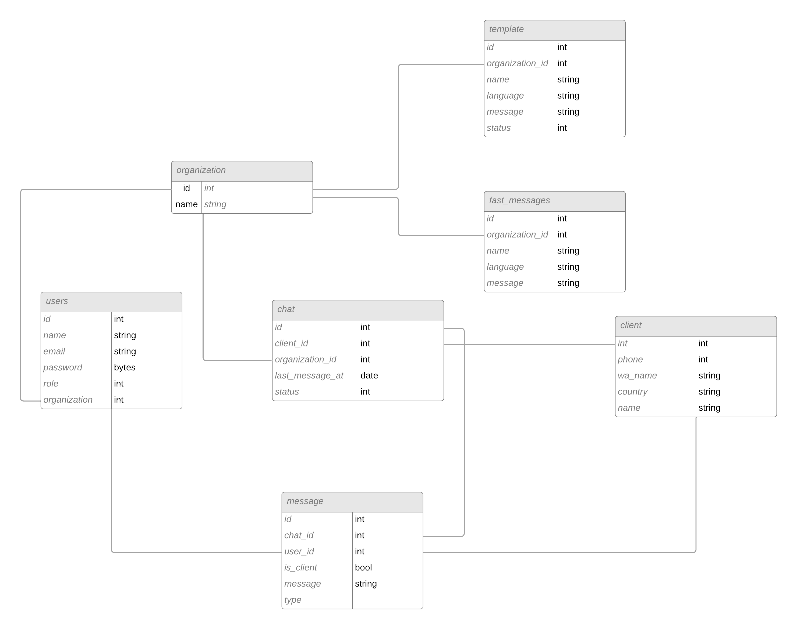

# back-communicenter

> ### First create virtual enviroment: 
> ~~~
> python -m venv "name of virtual enviroment"
> ~~~

 

> ### Watch requirements.txt and install depencences

  

>### Set enviroment variables in .env file
>env variables:
>~~~
>FLASK_RUN_PORT
>SECRET_KEY
>DEBUG
>FRONT_URL
>
>
>#DATABASE
>DB_USERNAME
>DB_PASSWORD
>DB_HOST
>DB_PORT
>DB_NAME
>
>#Whatsapp
>WA_PHONE_ID
>WB_ACCOUNT_ID
>WA_API_KEY
>~~~

 

>### Setup the database:
>~~~
>flask db init
>flask db migrate -m "migration name"
>flask db upgrade
>~~~

 

>### Run the application:
>~~~
>flask run
>~~~

     

## Database ER of the application (provisional):

